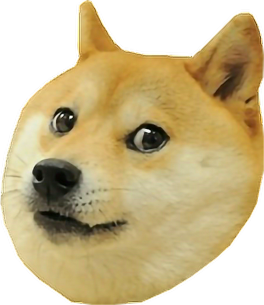
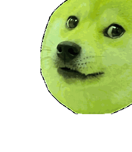

**Pogify** - Makes your reaction images more poggers. Useful when you want t

Installation
---------------------
The tool was built using only stock python (using Pillow). There is, however, a bug in transparent GIF generation that was fixed using some other code (in `gifsavefix.py`) - more details can be found in code comments.

 ```
 g++ gol.cpp -w -lSDL2 -lSDL2_ttf -o gol
 ```

Usage
---------------------
To find more info about using it you can run:

```
python3 pogify.py -h
```
Pogifying your images with default settings is pretty simple:

```
python3 pogify.py -i doge.png -o doge.gif
```
The above command generates the demo below. (epilepsy warning, colours and transition speed can all be modified using the supplied command line arguments or directly from code).
Demo
---------------------
