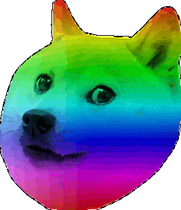

**Pogify** - Makes your reaction images more poggers. Useful when you want to *really* express excitment.

Installation
---------------------
The tool was built using only stock python (using Pillow). There is, however, a bug in transparent GIF generation that was fixed using some other code (`gifsavefix.py`) - more details can be found in code comments.

Usage
---------------------
To find more info about using it you can run:

```
python3 pogify.py -h
```
Pogifying your images with default settings is pretty simple:

```
python3 pogify.py -i doge.png -o doge.gif
```
The above command generates the demo below. Epilepsy warning, colours and transition speed can all be modified using the supplied command line arguments or directly from code - it should look alright if they're a tiny discord emote I think.

*NEW FEATURE* - you can now make static rainbow images by using the `-r` flag. A demo of what that looks like is below.

*NEWER FEATURE* - you can make an image flash through all the colors using the `-s` flag. This is a bit wonky, as the clustering algorithm which extracts the color palette is not deterministic and it's likely you will get different results on different runs. A fix would be to manually choose the palette size (how many dominant colors to extract) and which of the colors to flash. This, however, would probably defeat the purpose of this small project and I would have to add GUI as well. If there is any (at all) interest in this - it can be done. Previews for this feature, as usual, below.

Demo - flashing colours warning
---------------------
<details>
<Summary>Click here to view the output!</Summary>

</details>